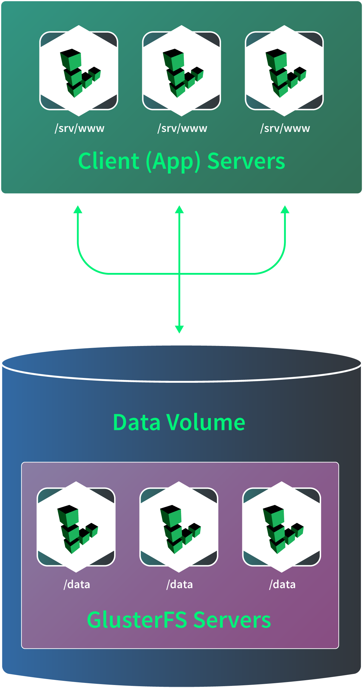

# GlusterFS Cluster with Ansible 


Deploy a highly available, replicated filesystem using the [Linode Ansible Collection](https://github.com/linode/ansible_linode) and [GlusterFS](https://www.gluster.org/). This playbook is intended to stand up a fresh deployment of three Gluster servers and three clients, including the provisioning of Linode instances, with the following configuration:

- Network encryption using TLS certificates
  - I/O encryption (server <--> client connections)
  - Management encryption (peer connections in trusted storage pool)
- Bricks directory: `/data`
- Volume name: `data-volume`
- Volume options:
  - transport.address-family: inet
  - nfs.disable: on
  - performance.cache-size: 1GB
  - cluster.server-quorum-type: server
  - features.cache-invalidation: on
  - performance.stat-prefetch: on
  - performance.io-thread-count: 50
  - cluster.lookup-optimize: on
  - performance.cache-swift-metadata: on
  - network.inode-lru-limit: 500000
  - cluster.readdir-optimize: on
  - client.event-threads: 8
  - server.event-threads: 8
  - performance.client-io-threads: on
  - performance.quick-read: on
  - performance.read-ahead: on
  - performance.md-cache-timeout: 60
  - performance.cache-refresh-timeout: 60
  - auth.ssl-allow: gluster1,gluster2,gluster3,client1,client2,client3
  - server.ssl: on
  - client.ssl: on
  - cluster.server-quorum-ratio: 51%

This should _not_ be used for updating an existing deployment. Additional playbooks can be run against the clients to install and configure applications that read/write to the Gluster volume, and against the servers for adding bricks, updating TLS certificates, performance tuning and so on.

## Distributions

- Ubuntu 20.04
- Debian 10 

## Installation
Create a virtual environment to isolate dependencies from other packages on your system.
```
python3 -m virtualenv env
source env/bin/activate
```

Install Ansible collections and required Python packages.
```
pip install -r requirements.txt
ansible-galaxy collection install linode.cloud gluster.gluster community.crypto
```

## Setup
Put your [vault](https://docs.ansible.com/ansible/latest/user_guide/vault.html#encrypting-content-with-ansible-vault) password in the `vault-pass` file. Encrypt your Linode root password and valid [APIv4 token](https://www.linode.com/docs/guides/getting-started-with-the-linode-api/#create-an-api-token) with `ansible-vault`. Replace the value of `@R34llyStr0ngP455w0rd!` with your own strong password and `pYPE7TvjNzmhaEc1rW4i` with your own access token.
```
ansible-vault encrypt_string '@R34llyStr0ngP455w0rd!' --name 'root_pass'
ansible-vault encrypt_string 'pYPE7TvjNzmhaEc1rW4i' --name 'token'
```

Copy the generated outputs to the `group_vars/gluster/secret_vars` file.
```
root_pass: !vault |
          $ANSIBLE_VAULT;1.1;AES256
          39623631373937663866363766353739653134373636333562376134333036666266656166366639
          3933633632663865313238346237306465333737386637310a623037623732643937373865646331
          62306535636531336565383465656333373736663136636431356133316266616530396565346336
          3837363732393432610a366436633664326262343830313662653234373363643836663662333832
          61316235363961323035316666346664626631663834663361626536323836633537363136643866
          6332643939353031303738323462363930653962613731336265
token: !vault |
          $ANSIBLE_VAULT;1.1;AES256
          36383638663330376265373564346562656435373464623337313964326134306132663533383061
          6236323531663431613065336265323965616434333032390a396161353834633937656137333231
          35383964353764646566306437623161643233643933653664323733333232613339313838393661
          3862623431373964360a353837633738313137373833383961653230386133313533393765663766
          34656362393962343139303139373562623634656233623661396662346162333938313136363630
          6365653234666565353634653030316638326662316165386637
```

Configure the Linode instance [parameters](https://github.com/linode/ansible_linode/blob/master/docs/instance.rst#id3), `server` and `client` prefixes, and `cluster_name` variables in `group_vars/gluster/vars`. As with the above, replace the example values with your own. This playbook was written to support `linode/debian10` and `linode/ubuntu20.04` images.
```
ssh_keys: ssh-rsa AAAA_valid_public_ssh_key_123456785== user@their-computer
server_prefix: gluster
client_prefix: client
cluster_name: POC
type: g6-standard-4
region: ap-south
image: linode/debian10
group: glusterfs
linode_tags: POC
```

## Usage
Run `provision.yml` to stand up the Linode instances and dynamically write your Ansible inventory to the `hosts` file. The playbook will complete when `ssh` becomes available on all instances. 
```
ansible-playbook provision.yml
```

Now run the `site.yml` playbook with the `hosts` inventory file. A pre-check takes place to ensure you're not running it against an existing GlusterFS cluster. Self-signed certificates are generated and pushed to the cluster nodes for securing replication traffic. Enjoy your new GlusterFS cluster!
```
ansible-playbook -i hosts site.yml
```

## Testing Replication
The client nodes mount the Gluster volume on `/srv/www`. Create a test file on one and make sure it replicates to the others.
```
root@client1:~# touch /srv/www/testfile

root@client2:~# ls /srv/www/
testfile

root@client3:~# ls /srv/www/
testfile
```

You should also see it in the `/data` bricks directory on all server nodes.
```
root@gluster1:~# ls /data
testfile

root@gluster2:~# ls /data
testfile

root@gluster3:~# ls /data
testfile
```
## Author

- Billy Thompson (@rylabs-billy)